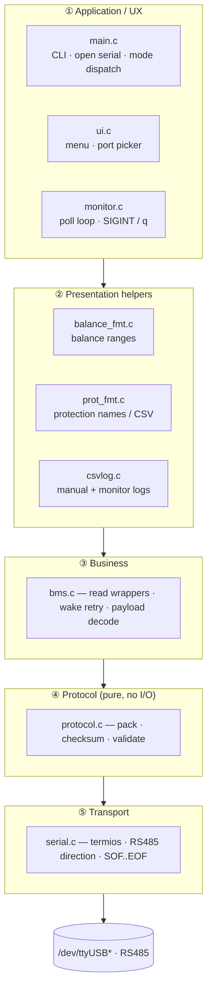
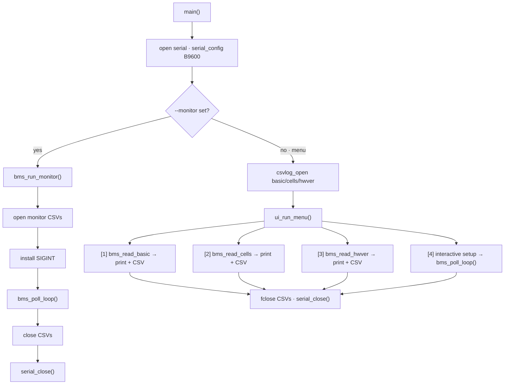
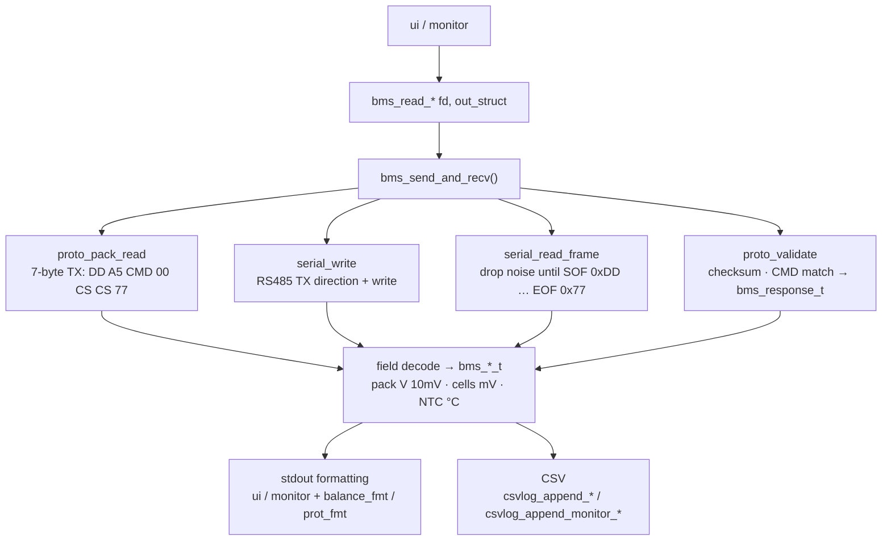
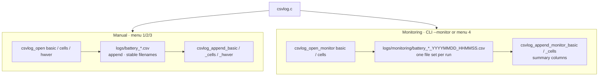

# BMS UART Query Tool — Software Architecture

**Product:** `bms_query` (Jiabaida Protocol V4 host tool)  
**Stack:** C11, POSIX, no third-party libraries  
**Hardware path:** Host ↔ USB–RS485 adapter ↔ Jiabaida BMS board (9600-8-N-1)

This document describes how the code under `src/` and `include/` is layered, how the three UX entry points share the same core, and how data flows from serial bytes to decoded structs, terminal output, and CSV logs.

---

## 1. Goals and constraints

| Goal | How the architecture supports it |
| --- | --- |
| Query three read commands (0x03 / 0x04 / 0x05) | Business API in `bms.c` + field decode into typed structs |
| Survive BMS deep-sleep wake delay | Shared `bms_send_and_recv()` with timeout-only retry (4 attempts) |
| Two UX styles (interactive + scriptable) | `main` dispatches to `ui` or `monitor`; both call the same BMS API |
| Separable offline verification | Pure protocol/format modules unit-tested without serial I/O |
| Dual CSV policies | Manual append logs vs. per-session timestamped monitor logs |

---

## 2. Layered view

Call direction: top → bottom (upper layers may call lower ones).

**Figure: Software layers and call direction**



| Layer | Modules | Role |
| --- | --- | --- |
| ① App | `main` `ui` `monitor` | CLI / menu / monitor entry & lifecycle |
| ② Presentation | `balance_fmt` `prot_fmt` `csvlog` | Human-readable output & CSV |
| ③ Business | `bms` | Read commands, retry, field decode |
| ④ Protocol | `protocol` | Pack / validate (no serial dependency) |
| ⑤ Transport | `serial` | Serial + RS485 half-duplex I/O |

**Dependency rule:** Upper layers may call lower layers; protocol and format helpers have no serial or UI dependencies. Transport does not know BMS command semantics.

---

## 3. Module map

| Module | Header | Role |
| --- | --- | --- |
| **main** | — | Entry: `--debug` / `--monitor` / `--interval`, port selection, open CSV handles for menu mode, dispatch |
| **ui** | `ui.h` | Scan `/dev/ttyUSB*` & `/dev/ttyACM*`, print menu, run 1/2/3 queries + menu `[4]` interactive monitor setup |
| **monitor** | `monitor.h` | `bms_run_monitor()` (CLI lifecycle) and `bms_poll_loop()` (shared poll body used by menu `[4]` path) |
| **bms** | `bms.h` | `bms_read_basic` / `bms_read_cells` / `bms_read_hwver`; decoded types; `bms_debug` |
| **protocol** | `protocol.h` | Frame constants, `bms_err_t`, pack/validate/checksum |
| **serial** | `serial.h` | Open/config/write/`serial_read_frame`/close; RS485 via `TIOCSRS485` + RTS fallback |
| **csvlog** | `csvlog.h` | `logs/` append files vs. `logs/monitoring/` timestamped files |
| **balance_fmt** | `balance_fmt.h` | Human-readable balance ranges for menu display |
| **prot_fmt** | `prot_fmt.h` | Protection status strings for stdout and monitor CSV |

Build layout (`Makefile`): objects in `build/`, binary at `install/bin/bms_query`, headers via `-Iinclude`.

---

## 4. Runtime modes and control flow

All modes share: **parse args → open FD → `serial_config(B9600)` → mode body → close**.

**Figure: main mode dispatch (monitor vs menu)**



| Mode | Trigger | Logging | Exit |
| --- | --- | --- | --- |
| Manual menu | `./bms_query [/dev/tty…]` | Append to `logs/*.csv` | Menu `q` |
| Menu monitor | Menu `[4]` | New files under `logs/monitoring/` | `q` / Ctrl+C |
| CLI monitor | `--monitor 03,04` | Same as menu monitor | `q` / Ctrl+C |

`--debug` sets global `bms_debug` so `bms_send_and_recv()` prints raw TX/RX hex on stderr in any mode.

---

## 5. Request/response data path

Single query (any of 0x03 / 0x04 / 0x05):

**Figure: Single read-command request / response path**



### Retry policy (wake from deep sleep)

Owned only by `bms_send_and_recv()` in `bms.c`:

| Constant | Value | Meaning |
| --- | --- | --- |
| `BMS_RESPONSE_TIMEOUT_MS` | 1000 | Per-attempt wait for a full frame |
| `BMS_MAX_RETRIES` | 3 | Extra attempts after first try (4 total) |
| `BMS_RETRY_DELAY_MS` | 200 | Pause between attempts |

- **Retry on:** no complete frame (timeout / write fail treated as retryable).
- **Do not retry on:** `BAD_FRAME` / `BAD_CHECKSUM` / `ERR_STATUS` after a full frame was received — the BMS answered; the error is returned as-is.

---

## 6. Protocol layer (pure functions)

`protocol.c` is I/O-free and is the primary offline-tested surface.

**Text: V4 frame skeleton**

```text
0xDD | 0xA5(read)/0x5A(write) | CMD | LEN | DATA… | CS_H | CS_L | 0x77
```

Checksum: `CS = ~(sum of bytes from CMD through end of DATA) + 1`, big-endian 16-bit.

| API | Purpose |
| --- | --- |
| `proto_pack_read` | Build fixed 7-byte read frame |
| `proto_pack_write` | Build write frame (present; MOS write 0xE1 not wired in UX yet) |
| `proto_checksum` | Two’s-complement checksum |
| `proto_validate` | SOF/EOF, length, checksum, expected CMD → `bms_response_t` |

Shared error enum `bms_err_t`: `OK`, `TIMEOUT`, `BAD_FRAME`, `BAD_CHECKSUM`, `STATUS`.

---

## 7. Transport layer

`serial.c` hides Linux serial + half-duplex RS485:

1. **Open** non-blocking device path.
2. **Config** raw 8-N-1, baud (caller passes `B9600`), enable kernel RS485 where available (`TIOCSRS485`), else manual RTS toggle on write.
3. **Write** full buffer, handling short writes / `EINTR`, asserting TX direction.
4. **Read frame** discard pre-SOF noise; accumulate until EOF `0x77` or timeout from SOF; cap by buffer size.
5. **Close** FD.

Higher layers pass opaque `int fd`; they never touch `termios` directly.

---

## 8. Business types (`bms.h`)

| Command | Function | Output type | Notes |
| --- | --- | --- | --- |
| 0x03 | `bms_read_basic` | `bms_basic_info_t` | Voltage, current sign, capacities, balance words, protection, FET, NTCs, SW version |
| 0x04 | `bms_read_cells` | `bms_cell_voltages_t` | Up to 48 cells, mV |
| 0x05 | `bms_read_hwver` | `bms_hw_version_t` | ASCII HW string ≤ 31 chars |

UI/monitor never parse raw payloads; they consume these structs only.

---

## 9. Logging architecture

**Figure: Manual logs vs monitoring logs**



Presentation helpers feed CSV where needed (`format_protection_names` for `triggered_protection`).

---

## 10. Presentation helpers

- **`balance_fmt`:** Collapse balance bitmaps (`balance_low` / `balance_high`) into range strings; used by menu basic-info print.
- **`prot_fmt`:** Map protection bits 0–12 to Chinese names; full sentence for terminal, name-only list for monitor CSV.

Both are pure string/bit helpers — suitable for unit tests without hardware.

---

## 11. Test architecture

| Binary | Sources under test | Focus |
| --- | --- | --- |
| `build/test_proto` | `protocol.o` | Frame pack/validate vs. PDF example frames |
| `build/test_balance` | `balance_fmt.o` | Range formatting edge cases |
| `build/test_prot` | `prot_fmt.o` | Protection name formatting |

`make test` builds and runs all three offline. Serial, UI, and full BMS decode paths are exercised on hardware / manual runs, not by these unit tests.

---

## 12. Source tree (architecture-relevant)

**Text: Architecture-relevant layout**

```text
bms-uart/
  include/           Public module APIs (one header per concern)
    bms.h  protocol.h  serial.h  ui.h
    monitor.h  csvlog.h  balance_fmt.h  prot_fmt.h
  src/               Matching implementations + main.c
  tests/             Offline unit tests (protocol / format)
  build/             Object files & test binaries
  install/bin/       bms_query
  logs/              Runtime CSV (manual + monitoring/)
```

---

## 13. Design principles (summary)

1. **Thin UX, fat domain:** Menu and monitor only orchestrate; decode and retry live in `bms.c`.
2. **Pure protocol core:** Pack/validate have no FD — easy to test and reuse.
3. **Transport isolation:** RS485 quirks stay in `serial.c`.
4. **Error codes over abort:** Business APIs return `bms_err_t`; only `main` / CLI setup use fatal exit for open/config failures.
5. **Dual log policies by intent:** Long-lived append files for ad-hoc queries; timestamped run files for experiments.
6. **Shared poll loop:** CLI and menu `[4]` reuse `bms_poll_loop()` so behavior stays consistent.

For protocol field layouts and command details, see the V4 PDF referenced in `README.md`. For operator usage and CSV column lists, see `README.md`.
