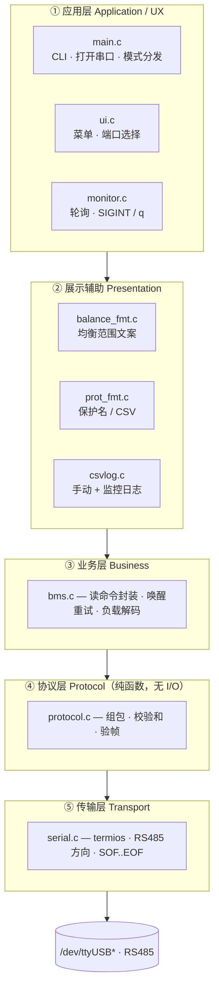
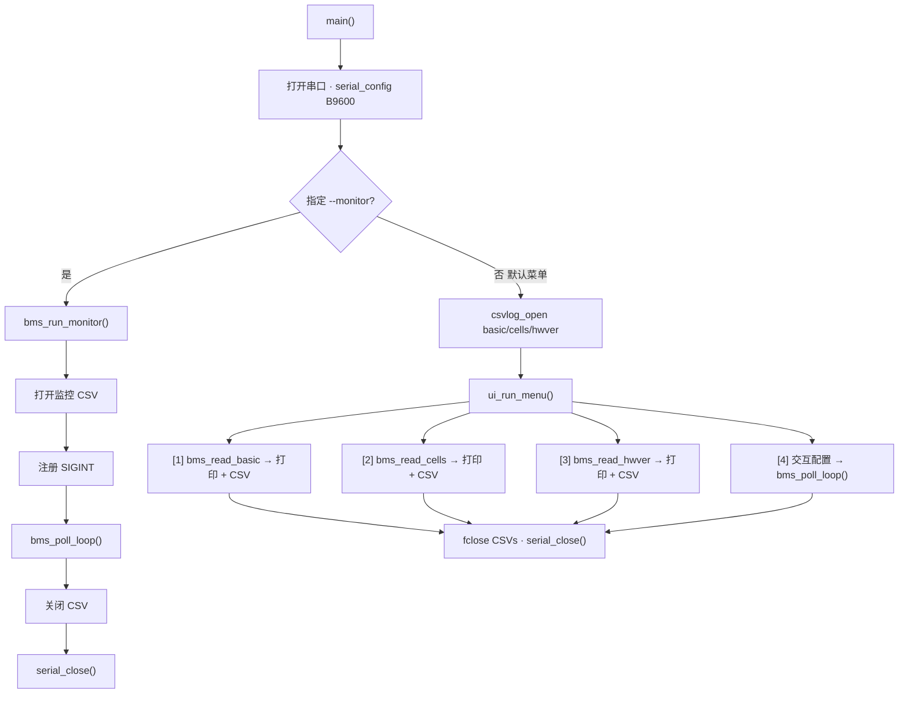
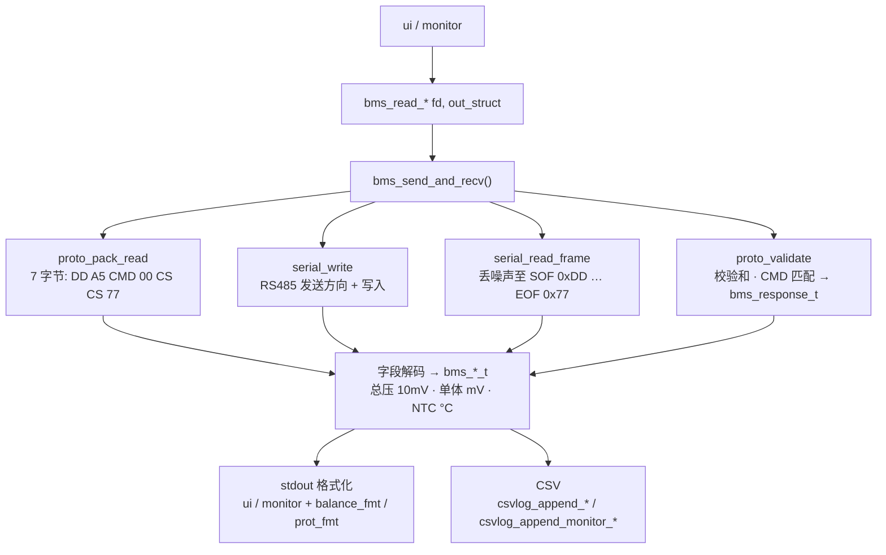
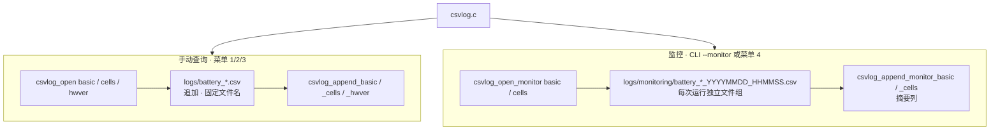

# BMS UART 查询工具 — 软件架构说明

**产品：** `bms_query`（嘉百达 V4 协议上位机工具）  
**技术栈：** C11、POSIX 标准、无第三方依赖库  
**硬件链路：** 主机 ↔ USB 转 RS485 适配器 ↔ 嘉百达 BMS 板卡 (9600-8-N-1)

本文档说明了 `src/` 与 `include/` 目录下的代码分层架构、三种用户交互入口如何共享同一套核心逻辑，以及数据如何从串口原始字节流流转解析为结构体、终端输出和 CSV 日志。

---

## 1. 目标与设计约束

| 目标 | 架构支持方式 |
| --- | --- |
| 支持三种读取命令 (0x03 / 0x04 / 0x05) | `bms.c` 提供业务 API 并将字段解析为类型化结构体 |
| 适应 BMS 深度休眠唤醒延迟 | 共用 `bms_send_and_recv()`，采用仅超时重试策略（最多 4 次尝试） |
| 支持双交互模式（交互式菜单 + 脚本化 CLI） | `main` 分发至 `ui` 或 `monitor`；两者均调用相同的 BMS API |
| 支持独立的离线测试与验证 | 纯协议/格式化模块与串口 I/O 解耦，可直接进行离线单元测试 |
| 双重 CSV 记录策略 | 手动单次查询全局追加日志 vs. 监控会话独立时间戳日志 |

---

## 2. 分层架构视图

调用方向：自上而下（上层可调用下层）。

**图：软件分层与调用方向**



| 层 | 模块 | 职责 |
| --- | --- | --- |
| ① 应用 | `main` `ui` `monitor` | CLI / 菜单 / 监控入口与生命周期 |
| ② 展示 | `balance_fmt` `prot_fmt` `csvlog` | 人话化输出与 CSV |
| ③ 业务 | `bms` | 读命令、重试、字段解码 |
| ④ 协议 | `protocol` | 组包 / 校验（无串口依赖） |
| ⑤ 传输 | `serial` | 串口与 RS485 半双工收发 |

**依赖规则：** 上层可调用下层；协议与格式化模块不依赖串口或 UI；传输层不感知 BMS 命令语义。

---

## 3. 模块映射表

| 模块 | 头文件 | 职责 |
| --- | --- | --- |
| **main** | — | 程序入口：解析 `--debug` / `--monitor` / `--interval` 参数，选择串口，为菜单模式打开 CSV 句柄，分发模式 |
| **ui** | `ui.h` | 扫描 `/dev/ttyUSB*` 与 `/dev/ttyACM*`，打印交互菜单，执行 1/2/3 查询以及菜单项 `[4]` 的交互式监控配置 |
| **monitor** | `monitor.h` | `bms_run_monitor()`（CLI 生命周期管理）与 `bms_poll_loop()`（菜单项 `[4]` 路径共用的底层轮询主体） |
| **bms** | `bms.h` | `bms_read_basic` / `bms_read_cells` / `bms_read_hwver` API；解析后的数据类型；`bms_debug` 调试开关 |
| **protocol** | `protocol.h` | 协议帧常量定义，`bms_err_t` 错误枚举，封包 / 校验 / 校验和计算 |
| **serial** | `serial.h` | 串口打开 / 配置 / 写入 / `serial_read_frame` / 关闭；通过 `TIOCSRS485` 支持 RS485 并提供 RTS 回退控制 |
| **csvlog** | `csvlog.h` | `logs/` 长期追加文件与 `logs/monitoring/` 独立时间戳运行文件管理 |
| **balance_fmt** | `balance_fmt.h` | 为菜单界面提供人类可读的均衡通道范围展示 |
| **prot_fmt** | `prot_fmt.h` | 为终端标准输出与监控 CSV 转换保护状态描述字符串 |

构建布局（`Makefile`）：目标文件位于 `build/`，二进制生成至 `install/bin/bms_query`，头文件通过 `-Iinclude` 引入。

---

## 4. 运行模式与控制流程

所有模式共享统一执行链路：**解析参数 → 打开设备文件描述符 (FD) → `serial_config(B9600)` → 执行模式主体 → 关闭清理**。

**图：main 模式分发（监控 vs 菜单）**



| 运行模式 | 触发方式 | 日志记录策略 | 退出方式 |
| --- | --- | --- | --- |
| 手动菜单模式 | `./bms_query [/dev/tty…]` | 追加写入至 `logs/*.csv` | 菜单输入 `q` |
| 菜单监控模式 | 菜单项 `[4]` | 在 `logs/monitoring/` 下创建新文件 | 输入 `q` / Ctrl+C |
| CLI 监控模式 | 命令行 `--monitor 03,04` | 与菜单监控模式相同 | 输入 `q` / Ctrl+C |

`--debug` 标志会置位全局变量 `bms_debug`，使 `bms_send_and_recv()` 在任何模式下都会向 stderr 打印发送与接收的原始十六进制数据。

---

## 5. 请求 / 响应数据链路

单次查询流程（适用于 0x03 / 0x04 / 0x05 任意命令）：

**图：单次读命令请求 / 响应链路**



### 重试策略（应对深度休眠唤醒）

该逻辑仅由 `bms.c` 中的 `bms_send_and_recv()` 统一管理：

| 常量 | 数值 | 含义 |
| --- | --- | --- |
| `BMS_RESPONSE_TIMEOUT_MS` | 1000 | 单次尝试等待完整数据帧的超时时间（毫秒） |
| `BMS_MAX_RETRIES` | 3 | 首次请求失败后的追加重试次数（总计 4 次尝试） |
| `BMS_RETRY_DELAY_MS` | 200 | 两次重试尝试之间的间隔等待时间（毫秒） |

- **何时重试：** 未收到完整帧（超时或写入失败被视为可重试错误）。
- **何时不重试：** 在收到完整数据帧后校验失败（如 `BAD_FRAME` / `BAD_CHECKSUM` / `ERR_STATUS`）——表明 BMS 已经响应，错误码将原样直接返回。

---

## 6. 协议层（纯函数）

`protocol.c` 不包含任何 I/O 操作，是主要支持离线单元测试的代码层。

**文本：V4 帧结构骨架**

```text
0xDD | 0xA5(读)/0x5A(写) | CMD | LEN | DATA… | CS_H | CS_L | 0x77
```

校验和算法：`CS = ~(CMD 到 DATA 结束的所有字节之和) + 1`，采用 16 位大端序（Big-Endian）。

| API | 用途 |
| --- | --- |
| `proto_pack_read` | 组装固定的 7 字节读取指令帧 |
| `proto_pack_write` | 组装写入指令帧（已实现；MOS 写入 0xE1 尚未在 UX 中开放） |
| `proto_checksum` | 计算二进制补码校验和 |
| `proto_validate` | 校验帧头/帧尾、长度、校验和以及预期 CMD → 输出 `bms_response_t` |

通用错误枚举 `bms_err_t`：`OK`、`TIMEOUT`、`BAD_FRAME`、`BAD_CHECKSUM`、`STATUS`。

---

## 7. 传输层

`serial.c` 封装并屏蔽了 Linux 串口及半双工 RS485 的底层细节：

1. **打开设备（Open）：** 以非阻塞方式打开串口设备路径。
2. **配置串口（Config）：** 设置 raw 8-N-1、波特率（由调用方传入 `B9600`），系统支持时启用内核 RS485 控制（`TIOCSRS485`），否则在写入时回退为手动切换 RTS 引脚。
3. **写入数据（Write）：** 完整写入缓冲区数据，处理部分写入与 `EINTR` 中断，并确保拉高 TX 发送方向。
4. **读取完整帧（Read frame）：** 丢弃起始符（SOF）之前的噪声数据；持续累积接收直到捕获结束符（EOF）`0x77` 或自 SOF 起发生超时；受缓冲区最大容量限制。
5. **关闭设备（Close）：** 关闭文件描述符 (FD)。

上层模块仅传递抽象的不透明文件描述符 `int fd`，从不直接接触 `termios` 结构体。

---

## 8. 业务数据类型 (`bms.h`)

| 命令字 | 对应函数 | 输出数据类型 | 详细说明 |
| --- | --- | --- | --- |
| **0x03** | `bms_read_basic` | `bms_basic_info_t` | 总电压、电流方向与数值、容量、均衡状态字、保护状态、MOS 状态、NTC 温度、固件版本 |
| **0x04** | `bms_read_cells` | `bms_cell_voltages_t` | 最多支持 48 串电芯单体电压（mV） |
| **0x05** | `bms_read_hwver` | `bms_hw_version_t` | ASCII 格式硬件版本字符串（≤ 31 字符） |

UI 和监控模块从不直接解析原始数据负载（payload），它们仅使用上述解析后的结构体。

---

## 9. 日志架构

**图：手动日志 vs 监控日志**



展示辅助模块按需为 CSV 提供数据支持（如通过 `format_protection_names` 提供 `triggered_protection` 保护状态字段）。

---

## 10. 展示与格式化辅助模块

- **`balance_fmt`：** 将均衡位图（`balance_low` / `balance_high`）压缩折叠为区间字符串（例如 `"1-3, 5, 12"`）；供菜单模式打印基础信息时使用。
- **`prot_fmt`：** 将 0–12 号保护状态位映射为中文名称；在终端中输出完整说明语句，在监控 CSV 中输出纯名称列表。

两者均为纯字符串/位运算辅助模块——非常适合在无硬件环境下进行单元测试。

---

## 11. 测试架构

| 测试二进制程序 | 待测试源文件 | 测试重点 |
| --- | --- | --- |
| `build/test_proto` | `protocol.o` | 协议帧组包/验证与 PDF 规范示例帧的比对 |
| `build/test_balance` | `balance_fmt.o` | 均衡范围格式化的边界情况 |
| `build/test_prot` | `prot_fmt.o` | 保护状态名称格式化转换 |

运行 `make test` 将编译并离线执行上述全部三个测试。串口通信、UI 交互及完整的 BMS 解码链路则通过连接真实硬件或手动运行进行测试，不包含在这些离线单元测试中。

---

## 12. 源码目录树（架构相关）

**文本：架构相关目录布局**

```text
bms-uart/
  include/           公共模块 API（按关注点一分一头文件）
    bms.h  protocol.h  serial.h  ui.h
    monitor.h  csvlog.h  balance_fmt.h  prot_fmt.h
  src/               对应实现 + main.c
  tests/             离线单测（协议 / 格式化）
  build/             *.o 与测试二进制
  install/bin/       bms_query
  logs/              运行时 CSV（手动 + monitoring/）
```

---

## 13. 设计原则总结

1. **薄交互，厚领域（Thin UX, fat domain）：** 菜单与监控模块仅负责流程编排；解码与重试逻辑统一收敛在 `bms.c` 中。
2. **纯净的协议核心（Pure protocol core）：** 封包与验证逻辑不依赖任何文件描述符——易于复用与测试。
3. **传输层隔离（Transport isolation）：** 所有的 RS485 硬件通信特性均限制在 `serial.c` 内部处理。
4. **优先返回错误码（Error codes over abort）：** 业务层 API 一律返回 `bms_err_t`；仅在 `main` 阶段或 CLI 初始化时针对打开/配置串口失败采取致命退出。
5. **按使用意图划分的双日志策略（Dual log policies by intent）：** 针对即时临时查询使用长期追加的固定文件；针对连续实验使用带时间戳的独立会话文件。
6. **共用轮询主循环（Shared poll loop）：** 命令行模式与菜单项 `[4]` 共享复用 `bms_poll_loop()`，确保行为一致性。

有关协议字段布局和命令详情，请参阅 `README.md` 中引用的 V4 PDF 协议文档。有关操作说明与 CSV 列字段说明，请参阅 `README.md`。
